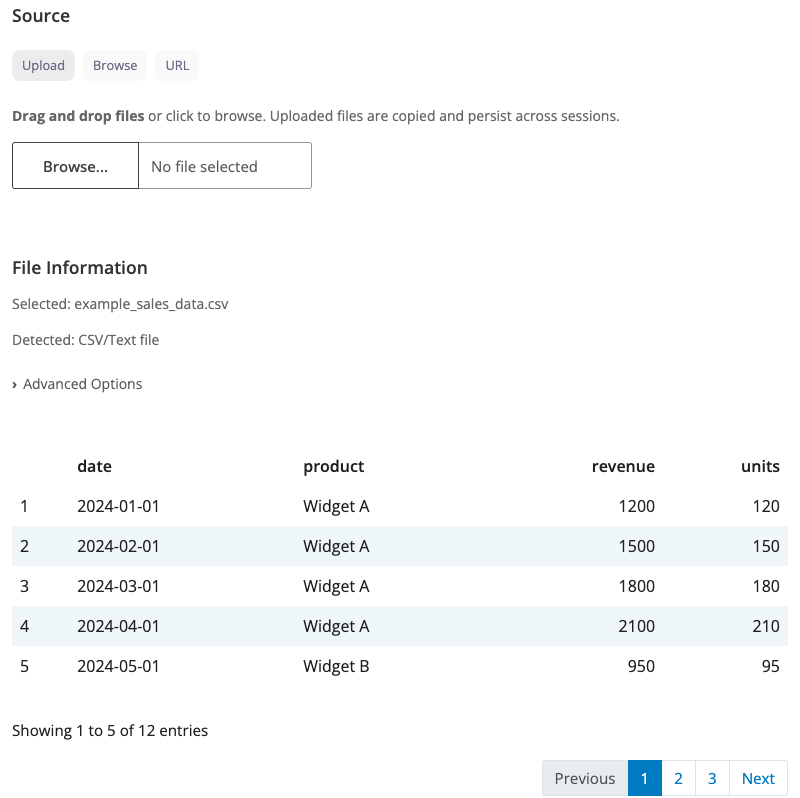

```{r, include = FALSE}
knitr::opts_chunk$set(
  collapse = TRUE,
  comment = "#>",
  echo = FALSE,
  warning = FALSE,
  message = FALSE
)
```

## Introduction

blockr.io provides a unified file reading block that handles multiple file formats with a smart, adaptive user interface. The block supports uploading files, browsing the file system, or downloading from URLs, making it easy to load data into your blockr pipelines.

---

## Read Block

The read block is a versatile data loading block that automatically adapts its interface based on the file type you're working with. It combines three different file source modes (upload, browse, URL) with format-specific options for CSV, Excel, and other file types.

### Three Ways to Load Data

**Upload Mode:** Drag and drop files or click to browse from your computer. Uploaded files are stored persistently, so they remain available across sessions. This is perfect for interactive data analysis where you want to upload a dataset once and keep working with it.

**Browse Mode:** Navigate your file system using an interactive file browser. Select files from configured folder paths. The block reads directly from the original file location without copying.

**URL Mode:** Download data directly from a web URL. Simply paste a URL pointing to a CSV, Excel, or other supported file format. The data is downloaded fresh when the session starts.

### Smart Interface

The block detects your file type and shows relevant options:

**CSV/TSV files** display options for delimiter (comma, semicolon, tab), quote character, encoding, row skipping, and whether the first row contains column names. This gives you full control over how delimited text files are parsed.

**Excel files** show dropdown menus for sheet selection, cell range specification (like "A1:C100"), row skipping, and column name options. You can target specific sheets and ranges within your Excel workbooks.

**Other formats** (Parquet, Feather, SPSS, Stata, SAS, JSON, XML, etc.) are handled automatically with minimal configuration. The block uses the appropriate reader based on file extension.

### Working with Multiple Files

When you select multiple files, the block provides combination strategies:

- **Auto**: Automatically stacks files vertically if they have the same columns, otherwise uses just the first file
- **Row bind**: Stack files vertically (requires files to have the same columns)
- **Column bind**: Place files side-by-side (requires files to have the same number of rows)
- **First only**: Use only the first file, ignore the others

This makes it easy to load and combine related datasets in one step.

```{r read-block, out.width="100%", fig.cap="Read block interface showing CSV options"}

```

---

## Supported File Formats

The block supports a wide range of file formats:

**Text formats:** CSV, TSV, TXT, fixed-width files

**Spreadsheets:** Excel (.xlsx, .xls), OpenDocument Spreadsheet (.ods)

**Statistical software:** SPSS (.sav), Stata (.dta), SAS (.sas7bdat, .xpt)

**Columnar formats:** Parquet, Feather, Arrow IPC

**Web formats:** JSON, XML, HTML

**R formats:** RDS, RData

**Database formats:** DBF, SQLite

---

## Building Data Pipelines

The read block works seamlessly with other blockr blocks. Load your data, then chain transformation and visualization blocks to create complete analysis workflows. The read block outputs a table that can be consumed by any downstream block, making it the perfect starting point for data analysis pipelines.

For example, you could:
1. Load sales data from a CSV file
2. Filter to show only high-revenue transactions
3. Create a line chart showing revenue over time

All without writing any code - just connect the blocks together!
